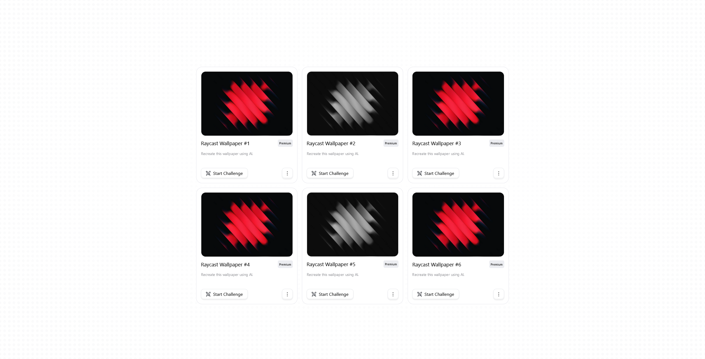

# (FR) Product Cards Challenge 🚀

Bienvenue dans le **Product Cards** ! Réalisé dans le cadre de la communauté Spikes Challenge, ce projet a été l'occasion de me familiariser avec **React** et **Tailwind CSS**, tout en renforçant mes compétences pratiques avec des concepts de bases interactives et dynamiques.

---

## 🎯 **Objectifs**

- Apprendre et pratiquer l'utilisation de **React** pour la création de composants dynamiques.
- Explorer les possibilités de **Tailwind CSS** pour un design rapide et efficace.
- Implémenter des fonctionnalités interactives pour enrichir l'expérience utilisateur.

---

## ✨ **Fonctionnalités**

- **Filtrage des produits** : 
  - **Par nom** : Barre de recherche qui filtre les produits en dynamique sans rechargement de page
  - **Par type** : Filtre des produits en fonction de leur statut premium ou free
- **Animations** : Animations fluides pour l'apparition et la mise à jour des produits
- **Modification des noms** : 
  - Chaque carte contient un bouton permettant de **modifier le nom du produit** en temps réel
- **Réinitialisation des filtres** :
  - Un bouton permet de **supprimer tous les filtres** appliqués pour afficher à nouveau la liste complète des produits

---

## ⚙️ **Technos Utilisées**

- **React.js** : Pour la gestion de l'état et la création des composants UI
- **Tailwind CSS** : Pour un stylisme rapide et réactif des cartes
- **Vercel** : Pour la configuration rapide de déploiement et gratuite

---
          
# (ENG) Product Cards Challenge 🚀

Welcome to the **Product Cards Challenge** ! Created as part of the Spikes Challenge community, this project was an opportunity to get familiar with **React** and **Tailwind CSS**, while reinforcing my practical skills in interactive and dynamic design concepts.

---

## 🎯 **Goals**

- Learn and practice using **React** for building dynamic components.
- Explore the capabilities of **Tailwind CSS** for fast and efficient design.
- Implement interactive features to enhance the user experience.

---

## ✨ **Features**

- **Product Filtering**:
  - **By Name**: A search bar dynamically filters products without page reloads.
  - **By Type**: Filter products based on their status (premium or free).
- **Animations**: Smooth animations for product appearance and updates.
- **Name Editing**:
  - Each card includes a button to **edit the product name** in real time.
- **Reset Filters**:
  - A reset button allows users to **clear all filters** and display the full product list again.

---

## ⚙️ **Technologies Used**

- **React.js**: For state management and UI component creation.
- **Tailwind CSS**: For fast and responsive card styling.
- **Vercel**: For quick and free deployment configuration.
